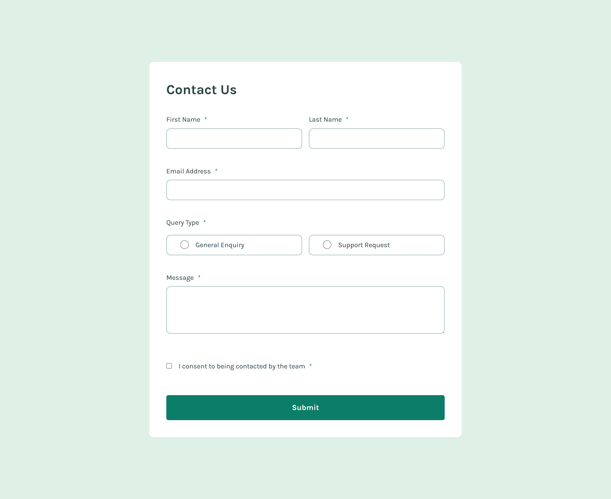

# Frontend Mentor - Contact form solution

This is a solution to the [Contact form challenge on Frontend Mentor](https://www.frontendmentor.io/challenges/contact-form--G-hYlqKJj). Frontend Mentor challenges help you improve your coding skills by building realistic projects.

## Table of contents

- [Overview](#overview)
  - [The challenge](#the-challenge)
  - [Screenshot](#screenshot)
  - [Links](#links)
- [My process](#my-process)
  - [Built with](#built-with)
  - [What I learned](#what-i-learned)
  - [Continued development](#continued-development)
- [Author](#author)

## Overview

### The challenge

Users should be able to:

- Complete the form and see a success toast message upon successful submission
- Receive form validation messages if:
  - A required field has been missed
  - The email address is not formatted correctly
- Complete the form only using their keyboard
- Have inputs, error messages, and the success message announced on their screen reader
- View the optimal layout for the interface depending on their device's screen size
- See hover and focus states for all interactive elements on the page

### Screenshot



### Links

- Solution URL: [Add solution URL here](https://your-solution-url.com)
- Live Site URL: [Add live site URL here](https://your-live-site-url.com)

## My process

### Built with

- Semantic HTML5 markup
- CSS custom properties
- Flexbox
- CSS Grid
- Mobile-first workflow

### What I learned

Shout out to Kevin Powell for this one! How to make the full area clickable for the radio button:

```html
<fieldset class="radio-set">
  <legend>Query Type</legend>
  <div class="radio-item">
    <label for="general-enquiry"
      ><input
        type="radio"
        id="general-enquiry"
        name="query-type"
        required
      />General Enquiry</label
    >
  </div>
  <div class="radio-item">
    <label for="support-request" class=""
      ><input
        type="radio"
        id="support-request"
        name="query-type"
        required
      />Support Request</label
    >
  </div>
</fieldset>
```

```css
.radio-item {
  ...

  position: relative;

  label::after {
    content: "";
    position: absolute;
    inset: 0;
  }
}
```

### Continued development

Need to continue developing form design skills

## Author

- Frontend Mentor - [@jkaps9](https://www.frontendmentor.io/profile/jkaps9)
